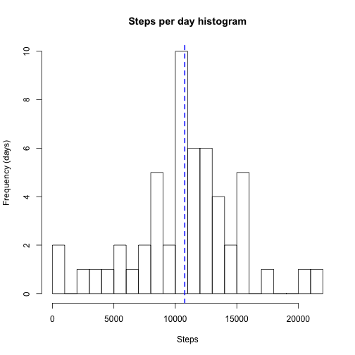
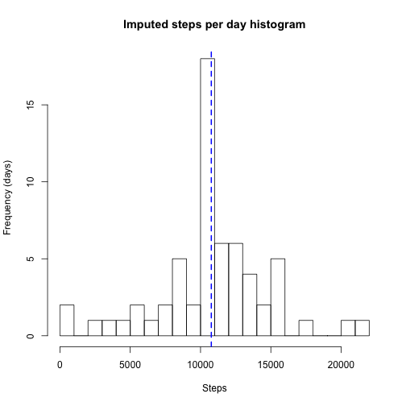
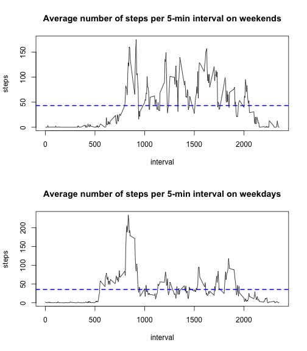

```r
library(plyr)
library(timeDate)
```

## Loading and preprocessing the data

```r
 ## unzip file if we need to
fileName <- "activity.csv"
if (!file.exists(fileName)){
  message("unzipping data...")
  unzip("activity.zip")
}

## read data
activity <- read.csv(fileName)

## explore data
head(activity)
```

```
##   steps       date interval
## 1    NA 2012-10-01        0
## 2    NA 2012-10-01        5
## 3    NA 2012-10-01       10
## 4    NA 2012-10-01       15
## 5    NA 2012-10-01       20
## 6    NA 2012-10-01       25
```

```r
## lots of NA steps, so let's see where there's data
head( activity[ which(activity$steps > 0,),] )
```

```
##     steps       date interval
## 555   117 2012-10-02     2210
## 556     9 2012-10-02     2215
## 627     4 2012-10-03      410
## 631    36 2012-10-03      430
## 644    25 2012-10-03      535
## 647    90 2012-10-03      550
```

## What is mean total number of steps taken per day?


```r
sumDaySteps <- aggregate(steps ~ date, data=activity, FUN=sum, na.rm=TRUE)
hist(sumDaySteps$steps, xlab="Steps", ylab="Frequency (days)", main="Steps per day histogram", breaks=25)
abline(v=mean(sumDaySteps$steps, na.rm=T), col = "blue", lwd = 2, lty="dashed")
```

 

Mean number of steps per day: 

```r
mean(sumDaySteps$steps)
```

```
## [1] 10766
```

Median number of steps per day:

```r
median(sumDaySteps$steps)
```

```
## [1] 10765
```

## What is the average daily activity pattern?

```r
meanPerInterval = aggregate(steps ~ interval, activity, mean, rm=TRUE)
plot(meanPerInterval, type="l", main="Average number of steps per 5-min interval")
```

 

Accross all days, the interval with the maximum number of steps is:

```r
meanPerInterval[which(meanPerInterval$steps == max(meanPerInterval$steps)), "interval"]
```

```
## [1] 835
```

## Imputing missing values
Number of rows with missing values:

```r
length(which(is.na(activity)))
```

```
## [1] 2304
```

As an imputing data strategy, we impute NA steps by replacing these with the mean number of steps for that interval.  We impute the data in a seperate data set.  

```r
names(meanPerInterval)[names(meanPerInterval)=="steps"] <- "mean.steps" # rename steps before merging in
imputedActivity <- merge(x=activity, y=meanPerInterval, by="interval", all.x=TRUE) # merge mean into activity set
imputedActivity <- arrange(imputedActivity,date, interval) # sort back to what it was, by date, by interval
imputedIndex <- which(is.na(imputedActivity$steps)) # find rows of NA steps
imputedActivity[imputedIndex, "steps"] <- round(imputedActivity[imputedIndex, "mean.steps"]) # impute data
```

We plot imputed data:

```r
sumDayStepsImputed <- aggregate(steps ~ date, data=imputedActivity, FUN=sum)
hist(sumDayStepsImputed$steps, xlab="Steps", ylab="Frequency (days)", main="Imputed steps per day histogram", breaks=25)
abline(v=mean(sumDayStepsImputed$steps), col = "blue", lwd = 2, lty="dashed")
```

 

Mean number of steps per day: 

```r
mean(sumDayStepsImputed$steps)
```

```
## [1] 10766
```

Median number of steps per day:

```r
median(sumDayStepsImputed$steps)
```

```
## [1] 10762
```

For imputed data, the mean number of steps remained the same, but the median changed slightly.  

## Are there differences in activity patterns between weekdays and weekends?

Let's mark which data is weekday or weekend

```r
activity$isweekday <- as.factor(ifelse(isWeekday(activity$date), "weekday", "weekend"))
```

We observe that weekends have an increase in steps per 5-minute interval throughout the day, albeit starting a little later in the day than on weekdays.  While weekdays have a higher number of steps as a single peak in the day.  

```r
par(mfrow=c(2,1))
meanPerIntervalWeekend = aggregate(steps ~ interval, activity[activity$isweekday == "weekend",], mean) 
plot(meanPerIntervalWeekend, type="l", main="Average number of steps per 5-min interval on weekends")
abline(h=mean(meanPerIntervalWeekend$steps), col = "blue", lwd = 2, lty="dashed")
meanPerIntervalWeekday = aggregate(steps ~ interval, activity[activity$isweekday == "weekday",], mean) 
plot(meanPerIntervalWeekday, type="l", main="Average number of steps per 5-min interval on weekdays")
abline(h=mean(meanPerIntervalWeekday$steps), col = "blue", lwd = 2, lty="dashed")
```

 


